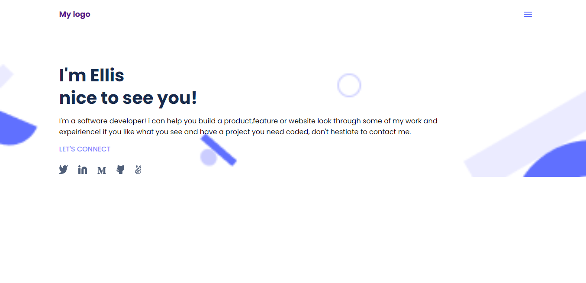

# mobile-version-skeleton

The project is inspired by the figma microverse template 1 (https://figma.com/)
For this portfolio mobile skeleton website, I implemented HTML and CSS for this part of the template
and i also used Linters to fix bugs and other errors in both css and html.

## Live Demo

[Live Demo Link](https://mwanawabangona.github.io/mobile-portfolio/)

## Built With

- HTML
- CSS
- linters (for errors)

## Authors

👤 **mwanawabangona**

- Location: Zambia
- GitHub: [@mwanawabangona](https://github.com/mwanawabangona)
- Twitter: [@Ellis_aah](https://twitter.com/Ellis_aah)
- LinkedIn: [LinkedIn](https://www.linkedin.com/in/ellis-ng-ona-50a600152/)

## 🤝 Contributing

Contributions, issues, and feature requests are welcome!

Feel free to check the [issues page](https://github.com/mwanawabangona/mobile-skeleton/issues).
.

## Show your support

Give a ⭐️ if you like this project!

## Acknowledgments

- special thanks to Microverse! 
- My standup team  and coding partners
- etc

## 📝 License

This project is [MIT](./MIT.md) licensed.
